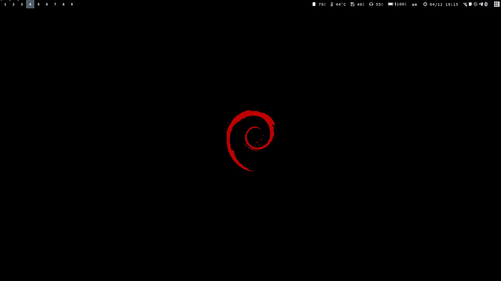

# System

**Suspending and locking screen**
```
sudo apt install lightdm light-locker
```

```shell
vim /etc/systemd/logind.conf

HandlePowerKey=suspend
HandleSuspendKey=suspend
HandleLidSwitch=suspend
HandleLidSwitchExternalPower=suspend
HandleLidSwitchDocked=suspend
HandleRebootKeyLongPress=poweroff
```

```shell
systemctl restart systemd-logind
```

```shell
vim /etc/systemd/system/wakelock@.service

[Unit]
Description=Lock the screen
Before=suspend.target

[Service]
User=%i
Type=forking
Environment=XDG_SEAT_PATH="/org/freedesktop/DisplayManager/Seat0"
ExecStart=/usr/bin/dm-tool lock

[Install]
WantedBy=supend.target
```

```shell
systemctl enable wakelock@<YOUR USERNAME>.service && systemctl daemon-reload
```

```shell
cat > /usr/share/applications/poweroff.desktop

[Desktop Entry]
Name=poweroff
Comment=Power off
Exec=sudo poweroff
Icon=system-shutdown
Type=Application
```

```shell
cat > /usr/share/applications

[Desktop Entry]
Name=reboot
Comment=Reboot system
Exec=sudo reboot
Icon=system-reboot
Type=Application
```

```shell
cat > /usr/share/applications/suspend.desktop

[Desktop Entry]
Name=suspend
Comment=Suspend system
Exec=systemctl suspend
Icon=system-suspend
Type=Application
```

# zsh

**Install zsh**
```shell
sudo apt install zsh &&\
sudo usermod -s /bin/zsh $USER
```

**Install oh-my-zsh**
```shell
sudo apt install git &&\
sh -c "$(wget -O- https://raw.githubusercontent.com/ohmyzsh/ohmyzsh/master/tools/install.sh)" &&\
zsh
```

**Install zsh exctensions**

Command syntax highlighting
```shell
git clone https://github.com/zsh-users/zsh-syntax-highlighting.git \
~/.oh-my-zsh/custom/plugins/zsh-syntax-highlighting
```

Search command history
```shell
git clone https://github.com/zsh-users/zsh-autosuggestions \
~/.oh-my-zsh/custom/plugins/zsh-autosuggestions
```

Install packages for plugins
```shell
sudo apt install grc chroma command-not-found
```

Spaceship prompt
```shell
git clone https://github.com/denysdovhan/spaceship-prompt.git \
"$ZSH_CUSTOM/themes/spaceship-prompt"

ln -s "$ZSH_CUSTOM/themes/spaceship-prompt/spaceship.zsh-theme" \
"$ZSH_CUSTOM/themes/spaceship.zsh-theme"
```

Install fonts
```shell
sudo apt install fonts-powerline fonts-symbola fonts-firacode
```

Change theme
```shell
sed -i -r 's/^ZSH_THEME=.*/ZSH_THEME=\"spaceship\"/g' ~/.zshrc
source ~/.zshrc
```

# tmux

**Install tmux**
```shell
sudo apt apt install tmux
```

**Install Tmux Plugin Manager**
```shell
git clone https://github.com/tmux-plugins/tpm ~/.tmux/plugins/tpm

tmux
```

**Install plugins**
```shell
Press prefix + I (capital i, as in Install) to fetch the plugin.
```

**Uninstalling plugins**
```shell
Press prefix + alt + u (lowercase u as in uninstall) to remove the plugin.
```

**Update plugin(s)**
```shell
Press prefix + alt + u.
```

# neovim

**Install neovim**
```shell
apt purge --auto-remove vim
apt install neovim
```

**Plugins**
```shell
sh -c 'curl -fLo "${XDG_DATA_HOME:-$HOME/.local/share}"/nvim/site/autoload/plug.vim --create-dirs \
  https://raw.githubusercontent.com/junegunn/vim-plug/master/plug.vim'
```

```shell
:so $MYVIMRC
:PlugInstall
```

```shell
# pyright
pip install pyright

# in project
python3 -m venv venv
source venv/bin/activate

git init

cat <<EOF > pyrightconfig.json
{
  "venv": "venv",
  "venvPath": "."
}
EOF
```
